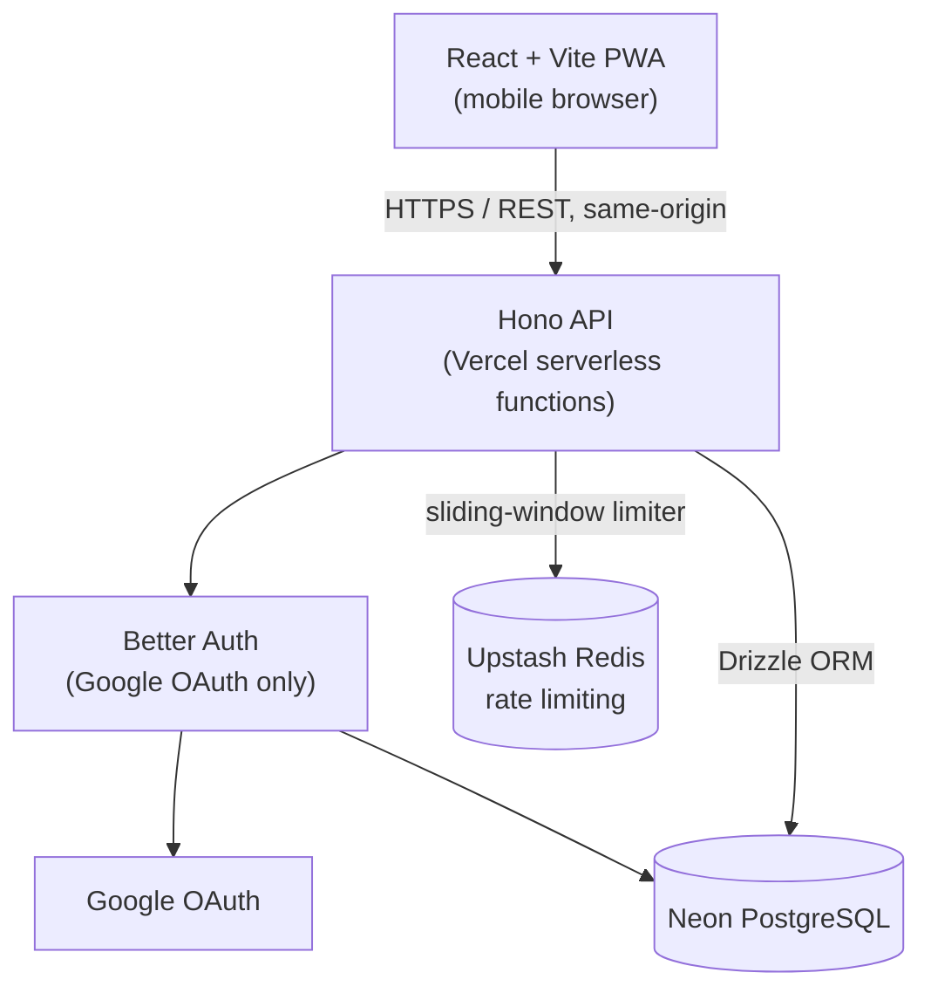
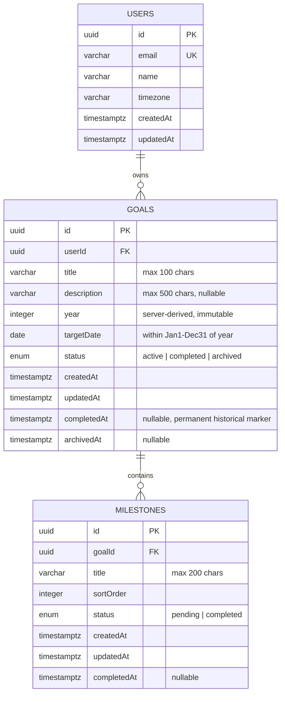

# 365 Goals — Architecture & Planning Document

**Status:** Phase 1 deliverable — analysis, architecture, contracts. No implementation yet, per your instructions.

---

## 1. Product Summary (as understood)

365 Goals is a single-user-per-account, mobile-first PWA that answers one question fast: *given how much of the year has passed, am I on pace to hit my goals?*

Core loop: `Year → Goal → Milestones → Progress % → Pace (Ahead/On Track/Behind) → Completion`.

Explicitly **not**: a task manager, calendar, social app, or notification-driven habit tracker. Explicitly **excluded from MVP**: search, categories, push notifications, weighted milestones, cross-year goals, offline sync.

The PRD is unusually well-specified for a personal project — most of Phase 1 below is filling real gaps rather than second-guessing settled decisions.

---

## 2. PRD Analysis — Gaps, Ambiguities, and Recommendations

| # | Category | Issue | Why it matters | Recommendation | Modify PRD? |
|---|---|---|---|---|---|
| 1 | **Missing flow** | No **year-rollover behavior** is defined. What happens to an incomplete 2026 goal on Jan 1, 2027? | This is the single biggest hole. Without a rule, the app either silently loses goals from view or the dashboard breaks on Jan 1. | The app always operates on `currentYear = new Date()` server-computed. Incomplete goals from prior years simply stop appearing on Home/Goals-Active (which are year-scoped) but remain fully queryable once a year selector ships (§23 already allows this). No auto-archival, no auto-carry-forward — that would be scope creep (recurring goals is explicitly P2). | **Yes** — add a short "Year Rollover" section. |
| 2 | **Contradiction** | `goals.status` enum is `active/completed/archived` (§17), but a goal also has independent `completedAt` and `archivedAt` timestamps (§25). If status is a single enum, can a goal be archived *after* being completed, and does it still count as "completed" in analytics? §22's formula (`Completed / Non-Archived`) implies archived goals drop out of the numerator too — silently deflating a user's own completion history. | Archiving your 12 completed 2026 goals in January 2027 shouldn't erase the fact that you completed them. | Keep `status` as the single current-state enum (drives filters/UI). Keep `completedAt` as a permanent historical marker independent of current status. Analytics "Completed Goals" counts `completedAt IS NOT NULL`, not `status = 'completed'`. The Goals-screen "Completed" *filter* still uses `status = 'completed'` (so archiving correctly moves it out of that tab into "Archived"). | **Yes** — clarify analytics counts by `completedAt`, not `status`. |
| 3 | **Missing API** | §27's endpoint list has `archive` but no **unarchive**. Archiving is stated to be reversible in spirit (users archive things they might revisit) but there's no way back. | Without this, archiving is effectively a soft-delete with no UI recovery path — bad UX for an irreversible-feeling action. | Add `POST /goals/:id/unarchive` → sets `status='active'` (simplest rule: unarchiving always returns to active; if it was completed before archiving, the user can re-complete in one tap since milestones are still intact). | **Yes.** |
| 4 | **Missing rule** | §12 says completed goals make milestones "read-only by default," but the milestone action list (edit/delete/complete/undo) doesn't say how this is enforced, and §40 allows reopening. | Without an explicit rule, it's ambiguous whether editing milestones is a client-side UI restriction (bypassable) or a backend rule. | Backend enforces it: mutation endpoints on milestones return `409 GOAL_NOT_ACTIVE` if the parent goal's status isn't `active`. Reopening (`status → active`) is what unlocks editing again. | **Yes** — make this a stated business rule, not just UI copy. |
| 5 | **Missing edge case** | A goal whose `targetDate` has passed but is still `active` and incomplete has no defined pace state. The formula in §18 (`elapsed/total duration`) would compute >100% expected progress. | Left undefined, this either crashes the pace calculation or silently shows a nonsensical percentage. | Clamp expected progress at 100% once `today > targetDate`. Pace becomes `Behind` (no new "Overdue" status needed — Behind already conveys it, and PRD deliberately avoids new stored/derived states beyond the three). Optionally show "X days overdue" as a UI-only label, not a new enum value. | **Yes**, one line. |
| 6 | **Missing spec** | "Progress not tracked" goals (§16.2) have no milestones, so they also have no defined pace (§18's formula needs milestone data). Dashboard ordering (§41) sorts by "Behind → nearest deadline → On Track → distant deadline" but never places milestone-less goals. | Without a rule, a goal with no milestones either crashes the sort or gets silently mis-bucketed as "Behind." | Milestone-less goals are pace-neutral: exclude them from the Ahead/On-Track/Behind bucketing and sort them by deadline only, placed after "Behind" and before "On Track" (since they're unmeasured, not confirmed fine). | **Yes**, minor addition to §41. |
| 7 | **Ambiguous requirement — RESOLVED** | §24 offers "Email/password OR Google," §57 says decision is open. | — | **Decided:** Google OAuth only via Better Auth. No local password storage at all, which fully satisfies §32's "trusted provider" language and is the simplest possible auth surface for a personal app. | **Yes** — §24/§57 should record Google-only as final, not "one or the other." |
| 8 | **Missing requirement — MOOT** | No password-reset flow was specified. | Would have mattered if email/password shipped. | Google-only auth means there's no password to reset, so this gap is closed by the decision above rather than by adding a reset flow. | No further change needed. |
| 9 | **Missing requirement** | Account deletion is mentioned as a requirement (§24, §47) but never appears in the API list (§27) or data model. | "Provide account deletion functionality" is stated as a hard requirement; without an endpoint it can't be built. | Add `DELETE /api/v1/account` — cascades to all goals/milestones, invalidates sessions, requires re-entering password (or a confirmation step) before executing. | **Yes.** |
| 10 | **Missing endpoint** | Milestone reordering: `sortOrder` exists in the schema, and drag-to-reorder is a natural mobile interaction for a milestone list, but no endpoint changes `sortOrder`. | Without it, milestones are stuck in creation order forever, which undercuts the "measurable intermediate outcomes in a sequence" intent. | Fold it into the existing `PATCH /milestones/:id` (accept an optional `sortOrder` field) rather than adding a new endpoint — avoids a proliferation of routes for a simple reorder. | **Yes**, one line. |
| 11 | **Validation gap** | §14 requires the deadline to fall within `Jan 1–Dec 31` of the current year, but nothing states what happens if a user is mid-creation on Dec 31 and the date rolls to Jan 1 while the form is open, or what year gets stamped on a goal created at 11:58 PM local time on Dec 31. | Silent inconsistency between `year` and `targetDate` would corrupt the composite index (`userId, year, status`) and confuse the countdown math. | `year` is always **server-derived** from the authenticated user's stored `timezone` at the moment of creation — never client-supplied, never independently editable after creation. `targetDate` is validated server-side against that same `year`. | **Yes**, small clarification. |
| 12 | **Security** | Rate limiting (§32) is required on auth and mutation endpoints, but true serverless functions (e.g., Vercel Functions) are stateless — there's no in-memory counter to rate-limit against. | Naively implementing this without shared state does nothing. | Use Upstash Redis (serverless-native, generous free tier) with a sliding-window limiter, applied as Hono middleware. For a genuinely single-tenant personal app this is mostly protecting against credential-stuffing on `/auth/login`, so keep it lightweight — no need for per-route tuning beyond auth + write endpoints. | No — implementation detail. |
| 13 | **Scalability (minor)** | §46's "Weekly Active Users" and event tracking (§45) assume some analytics pipeline, but none is specified anywhere else in the doc, and it's explicitly hedged ("if analytics infrastructure is available"). | Building event tracking infra for a single-user personal app is pure over-engineering relative to the brief's own "correctness → simplicity" priority order. | Skip product-analytics infrastructure entirely for MVP. The few numbers in §46 (goal/milestone completion rates) are trivially derivable later from existing DB rows — no event stream needed. | **Yes** — mark §45/§46 as explicitly out of MVP scope, not just conditional. |
| 14 | **Data consistency** | Cascade delete (`Goal → Milestones`) is specified, but nothing states cascade behavior for `User → Goal` if account deletion (gap #9) is implemented. | Undefined FK behavior on a rarely-exercised path (account deletion) is exactly the kind of thing that causes orphaned rows in production. | `ON DELETE CASCADE` from `users → goals → milestones`, consistent with the existing goal→milestone cascade rule. | **Yes**, one line tied to #9. |

**Everything else in the PRD is implementable as written** — the milestone-based progress formula, the three-state pace calculation, the empty/loading/error state requirements, the deadline rules, and the MVP/non-goal boundaries are all clear and consistent. I have not introduced any feature beyond what's needed to close the 14 gaps above.

---

## 3. Corrected MVP Scope

No features added. Two items reclassified based on the analysis above:

- **Password reset** and **account deletion** move from "unstated" to explicit **P0** — both are necessary for the auth model the PRD already commits to.
- **Analytics events / WAU tracking (§45–46)** moves from "conditional P-something" to **explicitly out of scope** — not deferred as P2, just not needed; the numbers it would feed are computable on demand from existing tables.

Everything else in §51's P0/P1/P2 breakdown stands as written.

---

## 4. Technology Stack

| Layer | Choice | Why | Alternatives considered |
|---|---|---|---|
| Frontend framework | **React 18 + TypeScript + Vite** | Specified by the PRD; also genuinely the right fit — fast dev server, no SSR complexity this app doesn't need. | Next.js (rejected: brings SSR/routing machinery this client-rendered PWA doesn't need) |
| Styling | **Tailwind CSS** | Utility classes keep a *lightweight* design system (PRD §9 explicitly asks for "lightweight") fast to build and easy for a solo dev to keep consistent without a component library. | CSS Modules (more boilerplate for the same result), a full component library like MUI (too heavy/opinionated for the minimal aesthetic the PRD wants) |
| Server state | **TanStack Query** | Specified by PRD §30; handles caching, refetch, and optimistic updates (needed for §36's tap-to-complete milestone UX) with minimal code. | SWR (comparable, smaller ecosystem for mutation-heavy optimistic-update patterns) |
| Forms/validation | **React Hook Form + Zod** | Specified by PRD §30. Zod schemas double as the runtime validation layer — see shared-schema note below. | Formik (heavier, less TS-native) |
| Backend runtime | **Hono**, deployed as Vercel serverless functions | Purpose-built for serverless TS APIs (PRD explicitly wants "Serverless API / TypeScript backend"), near-zero cold-start overhead, first-class Zod middleware for request validation, tiny and easy for a solo dev to reason about end to end. | Express (not serverless-native, more boilerplate), Fastify (great but less optimized for edge/serverless cold starts), raw Next.js API routes (would pull in a whole framework not otherwise needed since the PRD specifies a plain Vite frontend) |
| ORM / DB access | **Drizzle ORM** | Neon publishes a serverless HTTP driver Drizzle integrates with directly — no connection-pool management needed in a serverless function, which matters a lot for cold starts. SQL-like query builder is easy to reason about and keeps generated types tight. | Prisma (richer DX and larger ecosystem, but heavier client and less naturally serverless — Neon+Prisma needs an extra pooling layer). Reasonable to pick Prisma instead if you're more comfortable with it; flagged as a decision below. |
| Database | **Neon PostgreSQL** | Specified by PRD; serverless Postgres with branching, generous free tier, built-in automated backups (satisfies §48). | — (already decided) |
| Auth | **Better Auth**, configured for **Google OAuth only** (per your decision) | Self-hosted, free, TypeScript-native. Google-only means no password storage at all — fully satisfies §32's "trusted provider" language and sidesteps password-reset infrastructure entirely. Still runs through Better Auth so email/password can be added later as a config toggle, not a rewrite. | Clerk/Auth0 (recurring external dependency/cost), hand-rolled JWT+bcrypt (moot now — no passwords in this app), email/password with Better Auth (rejected — you chose to skip password infra) |
| Validation schema sharing | **A small shared package (`packages/shared`)** holding Zod schemas + the progress/pace calculation functions, imported by both frontend and backend | Satisfies the constraint "no duplicated business logic between frontend and backend" (Phase 6) directly — the *same* pace formula runs for optimistic client-side prediction and authoritative server calculation. | Duplicating logic in both apps (rejected — direct violation of the stated constraint) |
| Monorepo tooling | **pnpm workspaces** | Simplest way to share the `packages/shared` code above without publishing an npm package; no build orchestration tool (Turborepo/Nx) needed at this scale. | Two separate repos (would force copy-pasting shared schemas — same problem as above) |
| Hosting | **Vercel** for both `apps/web` (static) and `apps/api` (serverless functions) in one project | Same-origin frontend+API deployment eliminates CORS configuration entirely, single `vercel.json`, generous free tier, GitHub-integrated preview deploys. | Split hosting (Netlify + Render, etc.) — adds CORS config and two deploy pipelines for no real benefit at this scale |
| Rate limiting | **Upstash Redis** (sliding window, Hono middleware) | Only serverless-friendly way to share rate-limit state across stateless function invocations; generous free tier. | In-memory limiter (doesn't work across serverless invocations — false sense of security) |
| Icons | **Lucide React** | Clean, consistent stroke icons; already in your available React libraries. | — |
| Date/timezone math | **date-fns** | Lightweight, tree-shakeable, sufficient for the calendar-date (not timestamp) math PRD §20–21 requires; avoids pulling in a heavier library like Luxon for logic that's ultimately just day-counting. | Luxon (better timezone API but heavier; not needed since dates are stored as calendar dates, not zoned timestamps) |

---

## 5. High-Level Architecture



Single Vercel project, single origin, no CORS layer. Better Auth and the app's business tables live in the same Neon database — one connection story, one backup story. No transactional email dependency at all, since there's no password to reset.

---

## 6. Database / ER Model



**Notes:**
- `users` is managed by Better Auth's schema, extended with the custom `timezone` field (Better Auth supports additional user fields natively — no separate shadow table).
- Indexes: `goals(userId)`, composite `goals(userId, year, status)` (per PRD §25), `milestones(goalId, sortOrder)`.
- `ON DELETE CASCADE` on both foreign keys: `users → goals → milestones`.
- `completedAt` is intentionally decoupled from `status` for the analytics reason in gap #2 above — it's set once and never cleared except by an explicit "reopen" action.
- No soft-delete columns anywhere — the PRD's `archived` status already covers "hide but don't delete," and hard delete (with confirmation) covers the rest. Adding a separate `deletedAt` on top would be complexity the product doesn't need.

---

## 7. API Contract

Base path: `/api/v1`. All endpoints except `/auth/*` require a valid session (httpOnly cookie, managed by Better Auth); `userId` is always derived server-side from the session, never from the request body/params.

**Standard success shape:** `{ "data": ... }`
**Standard error shape:** `{ "error": { "code": "STRING_CODE", "message": "human-readable" } }`

### Auth

| Method | Route | Purpose | Notes |
|---|---|---|---|
| GET | `/auth/sign-in/google` | Start Google OAuth flow | Better Auth-generated route; redirects to Google's consent screen |
| GET | `/auth/callback/google` | OAuth callback | Better Auth-generated route; creates/links the user record (`name`, `email` from Google profile), sets httpOnly session cookie, redirects into the app |
| POST | `/auth/sign-out` | Log out | Invalidates session |
| GET | `/auth/session` | Get current session | Used by the frontend `AuthProvider` on load; `401` if not signed in |
| DELETE | `/account` | Delete account + all data | No password to confirm with — requires `{ confirmationText: "DELETE" }` typed by the user in the confirmation dialog; cascades to goals/milestones |

`timezone` is captured client-side (`Intl.DateTimeFormat().resolvedOptions().timeZone`) and sent on first sign-in via `PATCH /auth/user` (Better Auth's user-update route) rather than at sign-up, since there is no separate sign-up step with Google.

### Goals

| Method | Route | Purpose | Request body | Validation |
|---|---|---|---|---|
| GET | `/goals` | List current-year goals | Query: `status?=active\|completed\|archived` (default `active`) | — |
| POST | `/goals` | Create goal | `{ title, targetDate, description?, milestones?: [{title}] }` | `title` 1–100 chars; `targetDate` within Jan1–Dec31 of server-current year; `description` ≤500 chars |
| GET | `/goals/:id` | Goal detail incl. milestones | — | 404 if not found or not owned |
| PATCH | `/goals/:id` | Edit goal | `{ title?, description?, targetDate? }` | Same field rules as create; `year` never accepted |
| DELETE | `/goals/:id` | Permanently delete | — | Cascades to milestones; frontend must have already confirmed |
| POST | `/goals/:id/complete` | Mark complete | — | Sets `status='completed'`, `completedAt=now()`. `409 GOAL_ALREADY_COMPLETED` if already complete |
| POST | `/goals/:id/reopen` | Undo completion | — | Sets `status='active'`, clears `completedAt`. `409 GOAL_NOT_COMPLETED` otherwise |
| POST | `/goals/:id/archive` | Archive | — | Sets `status='archived'`, `archivedAt=now()`; `completedAt` untouched |
| POST | `/goals/:id/unarchive` | Restore | — | Sets `status='active'`; `409 GOAL_NOT_ARCHIVED` otherwise |

### Milestones

| Method | Route | Purpose | Request body | Validation |
|---|---|---|---|---|
| POST | `/goals/:id/milestones` | Add milestone | `{ title }` | 1–200 chars; `409 GOAL_NOT_ACTIVE` if parent goal isn't active |
| PATCH | `/milestones/:id` | Edit title / reorder | `{ title?, sortOrder? }` | Same 409 rule as above |
| DELETE | `/milestones/:id` | Delete | — | Same 409 rule as above |
| POST | `/milestones/:id/complete` | Mark complete | — | Sets `status='completed'`, `completedAt=now()` |
| POST | `/milestones/:id/uncomplete` | Undo | — | Sets `status='pending'`, clears `completedAt` |

### Analytics

| Method | Route | Purpose |
|---|---|---|
| GET | `/analytics/summary` | Current-year totals: goal counts by status, `completedAt`-based completion rate, milestone stats, pace distribution (Ahead/On Track/Behind/Not Tracked) |

### Standard error codes

```text
VALIDATION_ERROR        400
UNAUTHENTICATED         401
FORBIDDEN               403   (resource exists but isn't yours)
GOAL_NOT_FOUND          404
MILESTONE_NOT_FOUND     404
GOAL_NOT_ACTIVE         409
GOAL_ALREADY_COMPLETED  409
GOAL_NOT_COMPLETED      409
GOAL_NOT_ARCHIVED       409
RATE_LIMITED            429
INTERNAL_ERROR          500
```

`GOAL_NOT_FOUND` is deliberately returned (not `403`) when a goal exists but belongs to another user — this avoids leaking resource existence, per §47's privacy requirements.

---

## 8. Frontend Architecture

Folder structure (adopting PRD §29 as-is, inside a monorepo):

```text
apps/web/src/
├── app/
│   ├── router/          # route definitions, protected-route wrapper
│   ├── providers/        # QueryClientProvider, AuthProvider
│   └── layouts/          # bottom-nav shell, auth layout
├── features/
│   ├── auth/              # sign-in, sign-up, reset-password screens
│   ├── goals/             # list, detail, create/edit forms
│   ├── milestones/        # milestone list + inline actions
│   ├── dashboard/         # Home screen (countdown, overview)
│   └── analytics/
├── components/
│   ├── ui/                 # Button, Card, ProgressBar, Modal, Toast, Skeleton
│   └── common/            # EmptyState, ConfirmDialog
├── services/
│   └── api/                # thin fetch wrapper per resource, built on the shared Zod schemas
├── hooks/                  # useYearProgress, useGoalPace, etc. (wrap shared/ functions)
├── lib/
├── types/
└── utils/

packages/shared/src/
├── schemas/                # Zod schemas: goal, milestone, auth — imported by both apps
├── calculations/          # progress %, pace, year-progress math — single source of truth
└── constants/
```

**Key decisions:**
- **All API calls go through `services/api/`** — no component ever calls `fetch` directly (Phase 11 requirement). Each resource file wraps TanStack Query hooks.
- **Optimistic updates** are limited to milestone complete/uncomplete (PRD §36's explicit example) and goal complete — the two interactions where instant feedback matters most and rollback is simple.
- **Auth state** lives in a small `AuthProvider` backed by a `GET /auth/session` query; protected routes redirect to sign-in on 401.
- **Mobile-first layout**: bottom nav is the app shell (persists across Home/Goals/Analytics/Settings); 44px minimum touch targets enforced via Tailwind config; safe-area insets via `env(safe-area-inset-*)`.
- **Design tokens**: kept lightweight per PRD §9 — CSS variables for a small color set (background, surface, text-primary/secondary, accent, success/warning/danger for the Ahead/On-Track/Behind states), one type scale, one spacing scale. No dense data-table or dashboard-chrome patterns — those don't fit a single-user, single-screen-at-a-time mobile app, so I'm deliberately not carrying over admin-dashboard-style UI conventions here.
- **Reduced motion**: respect `prefers-reduced-motion`; animations limited to state transitions (progress bar fill, milestone check), not decorative motion — matches PRD §9's "avoid unnecessary animations."

---

## 9. Implementation Roadmap

Each phase is independently testable and deployable; none blocks more than the next one.

```text
Phase 0 — Monorepo & tooling setup (pnpm workspaces, shared package, lint/format config)
Phase 1 — Database schema + Drizzle migrations (users ext., goals, milestones)
Phase 2 — Auth (Better Auth wiring, sign-up/in/out, session middleware, protected routes)
Phase 3 — Goal APIs (CRUD + complete/reopen/archive/unarchive) with full validation + tests
Phase 4 — Milestone APIs (CRUD + complete/uncomplete + reorder) with tests
Phase 5 — Shared calculation package (progress %, pace, year-progress) with unit tests — built before any UI consumes it
Phase 6 — Frontend shell (routing, bottom nav, layouts, design tokens, empty/loading/error primitives)
Phase 7 — Auth screens + protected routing
Phase 8 — Home dashboard (year countdown, goal overview, ordering rules)
Phase 9 — Goals list + Goal detail + Create/Edit flows + milestone management UI
Phase 10 — Optimistic updates + confirmation dialogs (delete/archive/complete)
Phase 11 — Analytics screen
Phase 12 — PWA manifest/icons + responsive/accessibility pass
Phase 13 — Rate limiting on auth + mutation endpoints
Phase 14 — Deployment (Vercel + Neon prod config, env vars, migrations in CI)
```

---

## 10. Finalized Decisions

The three open forks are now settled:

| Decision | Chosen |
|---|---|
| Auth | **Google OAuth only** via Better Auth — no passwords, no reset flow, no email provider needed |
| ORM | **Drizzle** — lightweight, Neon-native, no connection-pool management in serverless functions |
| Repo structure | **pnpm monorepo** (`apps/web`, `apps/api`, `packages/shared`) — shared Zod schemas and calculation logic, one source of truth |

Architecture, stack table, API contract, and roadmap above have all been updated to reflect these. This closes Phase 1. Ready to move into Phase 16 implementation, starting with Phase 0 (monorepo + tooling setup) whenever you give the word.
